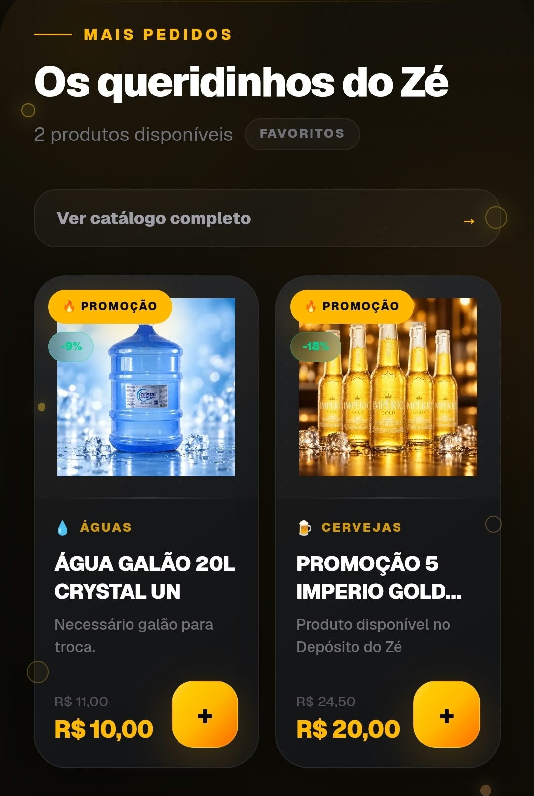
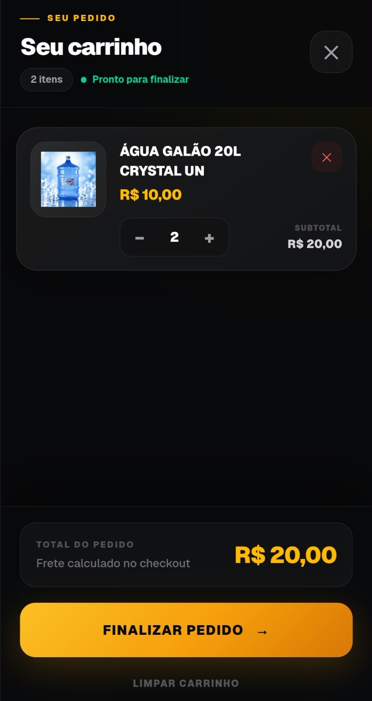
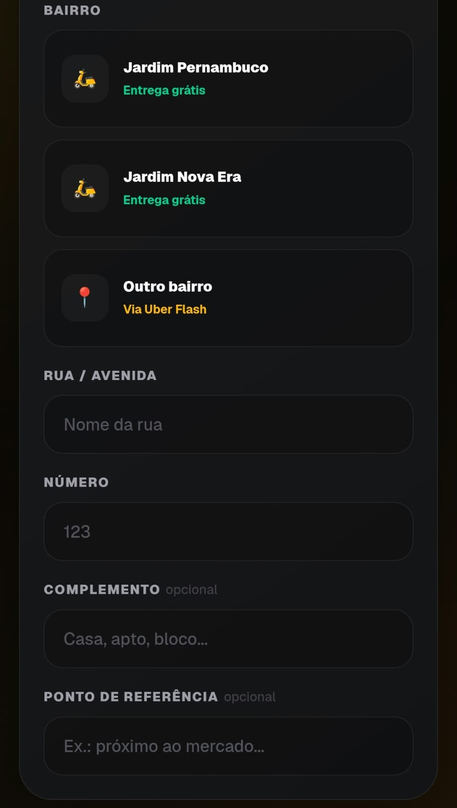
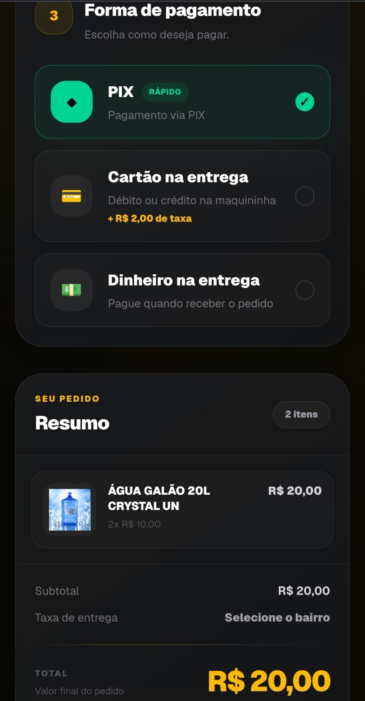
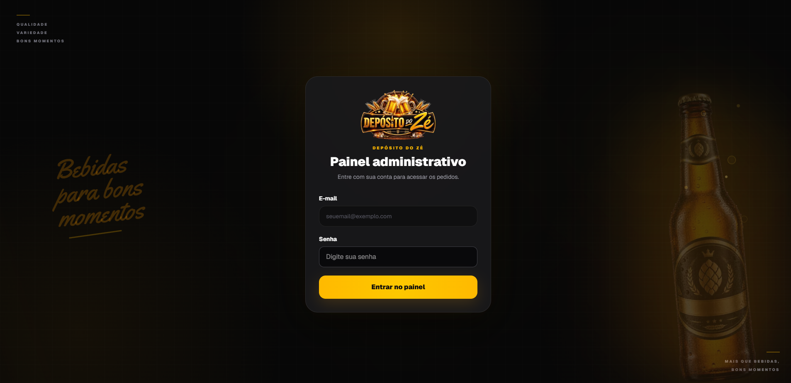
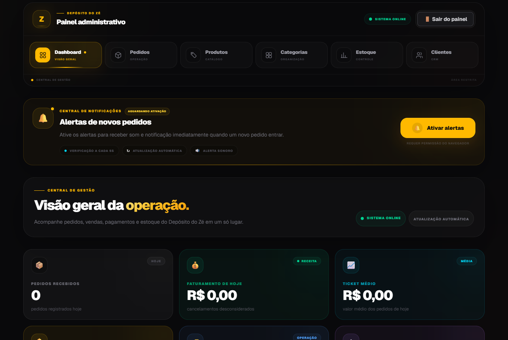

<div align="center">


# 🍻 Sistema de Gestão do Zé

### **Pedido fácil para o cliente. Controle completo para a operação.**


<br>


<br><br>


</div>

---

## 🍺 Sobre o projeto

O **Sistema de Gestão do Zé** foi desenvolvido para digitalizar a experiência de compra e apoiar a operação do **Depósito do Zé**.

O projeto conecta duas experiências dentro do mesmo produto:

<table>
<tr>

<td width="50%" valign="top">

### 👤 Cliente

O cliente navega pelo catálogo, encontra promoções, adiciona produtos ao carrinho, informa seus dados, endereço e forma de pagamento até concluir o pedido.

</td>

<td width="50%" valign="top">

### 🧑‍💼 Operação

A equipe utiliza um painel administrativo próprio para acompanhar pedidos, produtos, categorias, estoque, clientes e indicadores do negócio.

</td>

</tr>
</table>

> **Mais do que um catálogo online: uma solução construída para um negócio real.**

---

# 🍻 Vitrine digital

A experiência do cliente foi criada com foco em **mobile**, velocidade e facilidade na hora de comprar.

<div align="center">






</div>

<br>

### ⚡ Uma jornada simples

```text
🔎 ENCONTRAR
     ↓
🍺 ESCOLHER
     ↓
🛒 ADICIONAR
     ↓
📦 REVISAR
     ↓
💳 FINALIZAR
```

### O cliente encontra

`🔥 Promoções`
&nbsp;&nbsp;
`🔎 Busca`
&nbsp;&nbsp;
`🛒 Carrinho`
&nbsp;&nbsp;
`📱 Mobile First`

---

# 🧾 Checkout em etapas

O checkout foi dividido para deixar a finalização do pedido mais clara e reduzir atrito durante a compra.

<div align="center">






</div>

<br>

```text
CARRINHO
   ↓
DADOS DO CLIENTE
   ↓
LOCAL DE ENTREGA
   ↓
FORMA DE PAGAMENTO
   ↓
RESUMO
   ↓
PEDIDO
```

### 💳 Formas de pagamento

- 🟢 **PIX**
- 💳 **Cartão na entrega**
- 💵 **Dinheiro na entrega**

O sistema também trabalha com regras específicas da operação, como **taxas, áreas de entrega e condições do pedido**.

---

# 🖥️ Balcão de controle

Enquanto o cliente compra pelo celular, a equipe acompanha a operação por uma interface completamente separada.

## 🔐 Acesso administrativo

<div align="center">



</div>

<br>

O painel possui uma área de acesso própria para separar a experiência do cliente da gestão do negócio.

---

## ⚡ Central da operação

<div align="center">



</div>

<br>

A central administrativa organiza os principais setores da operação:

| Área | Função |
|---|---|
| 📊 **Dashboard** | visão geral do negócio |
| 📦 **Pedidos** | acompanhamento da operação |
| 🏷️ **Produtos** | gerenciamento do catálogo |
| 🗂️ **Categorias** | organização dos produtos |
| 📦 **Estoque** | acompanhamento de disponibilidade |
| 👥 **Clientes** | base e relacionamento com clientes |

### 📡 Operação em tempo real

O painel também possui estrutura para acompanhar:

`🔔 Novos pedidos`

`💰 Faturamento`

`📈 Ticket médio`

`🔄 Atualização automática`

`🟢 Status do sistema`

---

# ⚙️ Do pedido à operação

```mermaid
flowchart LR

    CLIENTE["👤 Cliente"]
    CATALOGO["🍺 Catálogo"]
    CARRINHO["🛒 Carrinho"]
    CHECKOUT["🧾 Checkout"]
    PAGAMENTO["💳 Pagamento"]
    API["⚙️ API"]
    BANCO[("☁️ Supabase")]
    PEDIDO["📥 Pedido"]
    ADMIN["🖥️ Painel Admin"]
    OPERACAO["🚚 Operação"]

    CLIENTE --> CATALOGO
    CATALOGO --> CARRINHO
    CARRINHO --> CHECKOUT
    CHECKOUT --> PAGAMENTO
    PAGAMENTO --> API
    API --> BANCO
    BANCO --> PEDIDO
    PEDIDO --> ADMIN
    ADMIN --> OPERACAO
```



---

# 🚀 Principais recursos

<table>
<tr>

<td width="50%" valign="top">

### 🍺 Para o cliente

- catálogo digital
- produtos em promoção
- busca de produtos
- carrinho interativo
- controle de quantidade
- checkout em etapas
- dados do cliente
- endereço de entrega
- regras por bairro
- múltiplas formas de pagamento
- experiência responsiva

</td>

<td width="50%" valign="top">

### ⚙️ Para a gestão

- área administrativa
- dashboard operacional
- acompanhamento de pedidos
- produtos
- categorias
- estoque
- clientes
- indicadores do negócio
- alertas de novos pedidos
- atualização automática

</td>

</tr>
</table>

---

# 🛠️ Tecnologias

<div align="center">

| Tecnologia | Uso no projeto |
|---|---|
| **Next.js** | aplicação, páginas, rotas e APIs |
| **React** | componentes e interface |
| **TypeScript** | tipagem e segurança |
| **Tailwind CSS** | design e responsividade |
| **Supabase** | banco de dados e persistência |
| **React Context** | gerenciamento do carrinho |
| **Git / GitHub** | versionamento |

</div>

---

# 🎯 Por que esse projeto existe?

O projeto nasceu para resolver situações reais do dia a dia de um pequeno negócio.

Não se trata apenas de colocar produtos em uma página.

O objetivo é conectar:

```text
CLIENTE
   +
PEDIDO
   +
DADOS
   +
OPERAÇÃO
   +
GESTÃO
```

para gerar uma experiência mais organizada tanto para quem compra quanto para quem administra.

### O desafio envolve

- reduzir processos manuais;
- facilitar compras pelo celular;
- organizar os pedidos;
- centralizar informações;
- melhorar a experiência do cliente;
- apoiar a tomada de decisão da operação.

> **Código aplicado a um problema real.**

---

# 🚧 Em evolução

```text
✅ Catálogo digital
✅ Promoções
✅ Carrinho
✅ Checkout
✅ Formas de pagamento
✅ Banco de dados
✅ Painel administrativo
✅ Gestão de pedidos
✅ Produtos
✅ Categorias
✅ Estoque
✅ Área de clientes

🔄 CRM e métricas de clientes
🔄 Histórico de compras
🔄 Fidelidade
🔄 Impressão térmica
🔄 Automações operacionais
🔄 Relatórios e indicadores
```

---

# ▶️ Executando o projeto

```bash
git clone https://github.com/CassianoCalian/sistema-gestao-delivery.git
```

```bash
cd sistema-gestao-delivery
```

```bash
npm install
```

```bash
npm run dev
```

Depois acesse:

```text
http://localhost:3000
```

---

<div align="center">

## 🍺 Mais agilidade. Mais controle. Menos complicação.

**Sistema desenvolvido para o Depósito do Zé.**

<br>

Desenvolvido por **Cassiano Calian**

<br><br>

[](https://github.com/CassianoCalian)

[](https://www.linkedin.com/in/cassianocalian/)

<br>

**🍻 BEBIDA GELADA • PEDIDO RÁPIDO • GESTÃO ORGANIZADA**

</div>
