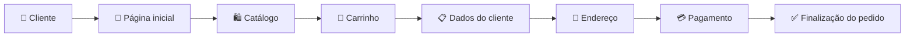

# 🍺 Sistema de Gestão do Zé

### Do catálogo ao checkout, uma experiência digital para um negócio real.

 

---

## ✨ Sobre o projeto

O **Sistema de Gestão do Zé** foi desenvolvido para digitalizar o atendimento e a operação do **Depósito do Zé**.

A proposta é transformar o processo de compra em uma experiência moderna, rápida e intuitiva, permitindo que o cliente:

- navegue pelo catálogo,
- adicione produtos ao carrinho,
- finalize o pedido com facilidade,
- e tenha uma jornada pensada para o uso no celular.

> Um projeto real, criado para resolver necessidades reais de venda, organização e experiência do cliente.

---

## 📱 Preview do sistema

  
  
  

 

  
  
  

---

## 🚀 Principais funcionalidades

- 🛒 **Catálogo digital** com produtos organizados
- ⭐ **Seção de ofertas e destaques**
- ➕ **Adição rápida ao carrinho**
- 📦 **Carrinho com resumo do pedido**
- 🧾 **Checkout em etapas**
- 📍 **Coleta de dados e endereço**
- 💳 **Escolha da forma de pagamento**
- ⚡ **Fluxo otimizado para dispositivos móveis**
- 🎨 **Identidade visual moderna e forte**

---

## 🧠 Fluxo da experiência

---

## 🛠️ Tecnologias utilizadas

| Tecnologia | Aplicação |
|---|---|
| **Next.js** | Estrutura da aplicação |
| **TypeScript** | Tipagem e segurança no desenvolvimento |
| **Tailwind CSS** | Estilização e responsividade |
| **Supabase** | Banco de dados e persistência |
| **React Context** | Gerenciamento do estado do carrinho |
| **Git & GitHub** | Versionamento do projeto |

---

## 🎯 Objetivo do projeto

O foco do sistema é unir:

- **experiência do usuário**,  
- **facilidade na compra**,  
- **organização do pedido**,  
- e **identidade visual marcante**.

Mais do que uma interface bonita, o projeto busca entregar uma solução funcional e aplicável ao dia a dia de um negócio real.

---

## 🔄 Próximas evoluções

- CRM de clientes  
- histórico de pedidos  
- promoções automáticas  
- área administrativa mais completa  
- notificações de pedido  
- impressão de pedidos  
- validação de área de entrega por CEP/bairro  

---

### 🍻 Tecnologia aplicada ao dia a dia de um negócio real.

Desenvolvido por **Cassiano Calian**  
[GitHub](https://github.com/CassianoCalian)

