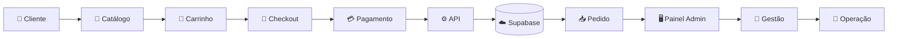

<div align="center">


<br>


</div>

---

## 🍺 Sobre o projeto

O **Sistema de Gestão do Zé** foi desenvolvido para digitalizar a experiência de compra e apoiar a operação do **Depósito do Zé**.

A aplicação conecta dois lados do negócio:

<table>
<tr>
<td width="50%" valign="top">

### 👤 Cliente

Navega pelo catálogo, encontra promoções, monta o carrinho, informa os dados de entrega, escolhe a forma de pagamento e finaliza o pedido.

</td>

<td width="50%" valign="top">

### 🧑‍💼 Administração

Centraliza pedidos, produtos, categorias, estoque, clientes e informações importantes para a operação do estabelecimento.

</td>
</tr>
</table>

> **Mais do que um catálogo online: uma solução criada para um negócio real.**

---

# 📱 Experiência do cliente

<div align="center">


</div>

<br>

A jornada foi construída com foco principalmente em **dispositivos móveis**, utilizando uma identidade visual própria para tornar a experiência de compra simples e direta.

### ✨ Recursos para o cliente

`🔎 Busca de produtos`
&nbsp;
`🔥 Promoções`
&nbsp;
`🛒 Carrinho`

`📍 Entrega`
&nbsp;
`💳 Pagamento`
&nbsp;
`✅ Finalização`

O checkout permite trabalhar com diferentes formas de pagamento, endereço de entrega e regras específicas do negócio.

---

# 🖥️ Painel administrativo

O sistema também possui uma área exclusiva para a operação do Depósito do Zé.

## 🔐 Área administrativa

<div align="center">


</div>

<br>

O acesso administrativo possui uma interface separada da experiência do cliente, mantendo a operação centralizada em um ambiente próprio.

---

## ⚡ Central de gestão

<div align="center">


</div>

<br>

O painel reúne os principais setores da operação:

| Área | Objetivo |
|---|---|
| 📊 **Dashboard** | visão geral da operação |
| 📦 **Pedidos** | acompanhamento dos pedidos |
| 🏷️ **Produtos** | gerenciamento do catálogo |
| 🗂️ **Categorias** | organização dos produtos |
| 📦 **Estoque** | acompanhamento de disponibilidade |
| 👥 **Clientes** | organização da base de clientes |

O dashboard também concentra informações operacionais como **pedidos recebidos, faturamento, ticket médio e status do sistema**, além da estrutura para alertas de novos pedidos.

---

# ⚙️ Como o sistema funciona



---

# 🚀 Principais funcionalidades

<table>
<tr>

<td width="50%" valign="top">

### 👤 Cliente

- catálogo digital
- busca de produtos
- promoções e destaques
- carrinho interativo
- controle de quantidade
- checkout em etapas
- dados do cliente
- endereço de entrega
- seleção de bairro
- PIX
- cartão na entrega
- dinheiro na entrega
- experiência responsiva

</td>

<td width="50%" valign="top">

### 🧑‍💼 Administração

- área administrativa
- dashboard operacional
- acompanhamento de pedidos
- atualização de status
- gerenciamento de produtos
- categorias
- controle de estoque
- área de clientes
- indicadores operacionais
- alertas de novos pedidos

</td>

</tr>
</table>

---

# 🧾 Jornada do pedido

```text
PRODUTO
   ↓
CARRINHO
   ↓
DADOS DO CLIENTE
   ↓
LOCAL DE ENTREGA
   ↓
FORMA DE PAGAMENTO
   ↓
RESUMO DO PEDIDO
   ↓
PEDIDO REGISTRADO
   ↓
PAINEL ADMINISTRATIVO
```

---

# 🛠️ Tecnologias

<div align="center">

| Tecnologia | Utilização |
|---|---|
| **Next.js** | aplicação, páginas, rotas e APIs |
| **React** | componentes e interface |
| **TypeScript** | tipagem e segurança |
| **Tailwind CSS** | design e responsividade |
| **Supabase** | banco de dados e persistência |
| **React Context** | gerenciamento do carrinho |
| **Git & GitHub** | versionamento |

</div>

---

# 🧠 O desafio

O projeto não foi criado apenas como exercício de desenvolvimento.

Ele nasceu para trabalhar problemas reais de uma operação comercial:

- reduzir processos manuais;
- organizar pedidos;
- facilitar compras pelo celular;
- centralizar informações;
- melhorar a experiência do cliente;
- apoiar a gestão do estabelecimento.

> **Software como ferramenta para melhorar um negócio real.**

---

# 🚧 Em evolução

```text
✅ Catálogo digital
✅ Promoções
✅ Carrinho
✅ Checkout
✅ Formas de pagamento
✅ Integração com banco de dados
✅ Painel administrativo
✅ Gestão de pedidos
✅ Produtos
✅ Categorias
✅ Estoque

🔄 CRM e métricas de clientes
🔄 Histórico de compras
🔄 Fidelidade
🔄 Impressão térmica
🔄 Automações operacionais
🔄 Evolução dos relatórios
```

---

# ▶️ Executando localmente

```bash
git clone https://github.com/CassianoCalian/sistema-gestao-delivery.git

cd sistema-gestao-delivery

npm install

npm run dev
```

---

<div align="center">


### 🍻 Mais agilidade. Mais controle. Mais experiência.

Desenvolvido por **Cassiano Calian**

[](https://github.com/CassianoCalian)
[](https://www.linkedin.com/in/cassianocalian/)

</div>
